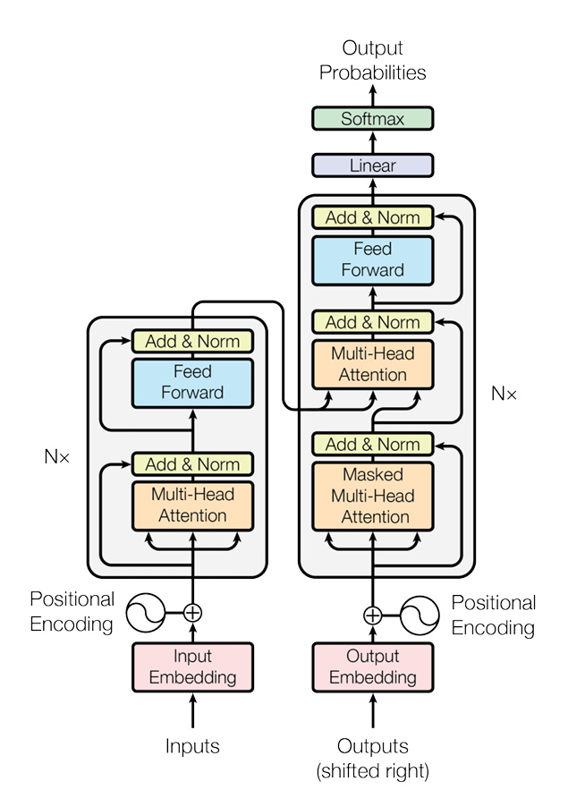
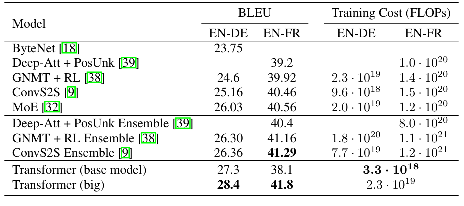

# Attention Is All You Need 논문 정리

## 1. 선정 이유

AI를 처음 공부하는 입장에서, 현재 가장 널리 사용되는 기법 중 하나인 **Transformer**를 제대로 이해해보고 싶었다. 특히 최근의 대규모 언어 모델, 번역 모델, 이미지 생성 모델 등 다양한 AI 기술의 기반에 Transformer가 사용되고 있기 때문에, 그 출발점이 된 논문인 **Attention Is All You Need**를 선정하였다.

이 논문은 기존의 RNN이나 CNN 중심의 시퀀스 처리 방식에서 벗어나, **Attention 메커니즘만으로도 좋은 성능을 낼 수 있다**는 것을 보여준 중요한 논문이다. 따라서 AI를 공부하기 시작하는 단계에서 Transformer의 기본 구조와 Attention의 역할을 이해하는 데 적합하다고 생각했다.

## 2. 내가 이해한 핵심

이 논문의 핵심은 **Attention만으로도 시퀀스 데이터를 효과적으로 처리할 수 있다**는 것이다. 기존에는 번역이나 문장 생성 같은 작업에서 RNN, LSTM, GRU 같은 순환 신경망 구조가 많이 사용되었다. 이런 모델들은 문장을 앞에서부터 순서대로 읽으면서 정보를 처리한다.

하지만 기존 모델은 단어를 순차적으로 처리해야 하기 때문에 병렬 처리가 어렵고, 문장이 길어질수록 앞쪽 정보가 뒤쪽까지 잘 전달되지 않는 문제가 있다. Transformer는 이러한 문제를 해결하기 위해 **Self-Attention**을 중심으로 한 새로운 구조를 제안했다.

### Self-Attention

Self-Attention은 문장 안의 각 단어가 다른 단어들과 어떤 관계를 가지는지 계산하는 방식이다.

예를 들어, “The animal didn’t cross the street because it was too tired.”라는 문장이 있을 때, 여기서 “it”이 무엇을 가리키는지 이해하려면 앞에 나온 “animal”과의 관계를 파악해야 한다. Self-Attention은 각 단어가 문장 안의 다른 단어들을 얼마나 중요하게 참고해야 하는지를 계산한다.

즉, 어떤 단어를 이해할 때 그 단어 하나만 보는 것이 아니라, 문장 전체에서 관련 있는 단어들에 더 많은 가중치를 두고 정보를 가져오는 방식이다.

### Query, Key, Value

Self-Attention은 보통 **Query, Key, Value**라는 세 가지 개념으로 설명된다.

각 단어는 Query, Key, Value라는 세 벡터로 변환된다.

- **Query**: 현재 단어가 어떤 정보를 찾고 있는지 나타낸다.
- **Key**: 각 단어가 어떤 정보를 가지고 있는지 나타낸다.
- **Value**: 실제로 전달될 정보이다.

Attention은 Query와 Key를 비교해서, 현재 단어가 다른 단어들을 얼마나 중요하게 봐야 하는지 계산한다. 그다음 계산된 중요도에 따라 Value를 가중합하여 새로운 표현을 만든다.

간단히 말하면, Query는 “내가 찾는 정보”, Key는 “내가 가진 정보의 특징”, Value는 “실제로 전달할 내용”이라고 볼 수 있다.

### Scaled Dot-Product Attention

논문에서 사용한 Attention 방식은 **Scaled Dot-Product Attention**이다.

Query와 Key의 내적을 계산하면 두 단어가 얼마나 관련 있는지 알 수 있다. 관련성이 높으면 값이 커지고, 낮으면 값이 작아진다. 그 후 softmax를 적용하여 각 단어에 대한 가중치를 만들고, 이 가중치를 Value에 곱해 최종 결과를 얻는다.

여기서 “Scaled”라는 말이 붙은 이유는 Query와 Key의 차원이 커질수록 내적 값이 너무 커질 수 있기 때문이다. 값이 너무 커지면 softmax 결과가 극단적으로 변할 수 있으므로, 논문에서는 이를 방지하기 위해 차원의 제곱근으로 나누어준다.

### Multi-Head Attention

Transformer의 중요한 특징 중 하나는 **Multi-Head Attention**이다.

하나의 Attention만 사용하면 단어 간의 관계를 한 가지 관점에서만 볼 수 있다. 하지만 문장 속 단어들은 여러 종류의 관계를 가진다. 어떤 단어는 문법적으로 연결될 수 있고, 어떤 단어는 의미적으로 연결될 수 있다.

Multi-Head Attention은 여러 개의 Attention을 병렬로 사용한다. 각각의 Attention head는 서로 다른 관점에서 단어 간 관계를 학습한다. 예를 들어 한 head는 주어와 동사의 관계를 볼 수 있고, 다른 head는 대명사가 어떤 명사를 가리키는지 볼 수 있다.

이렇게 여러 head가 얻은 결과를 합친 뒤 다시 선형 변환하여 최종 출력으로 사용한다. 덕분에 모델은 문장 안의 다양한 관계를 더 풍부하게 학습할 수 있다.

### Masked Multi-Head Attention

Decoder에서는 **Masked Multi-Head Attention**이 사용된다.

문장을 생성할 때는 아직 생성되지 않은 미래 단어를 보면 안 된다. 예를 들어 번역 문장을 왼쪽에서 오른쪽으로 생성하고 있다면, 현재 위치의 단어는 이전에 생성된 단어들만 참고해야 한다.

Masked Multi-Head Attention은 미래 위치의 단어를 보지 못하도록 가리는 역할을 한다. 이를 통해 모델이 실제 문장 생성 상황과 같은 조건에서 학습할 수 있게 된다.

### Encoder-Decoder Attention

Decoder에는 또 하나의 Attention이 들어간다. 이것은 Encoder의 출력과 Decoder의 현재 상태를 연결하는 역할을 한다.

Encoder는 입력 문장을 이해한 결과를 만들고, Decoder는 출력 문장을 생성한다. 이때 Decoder는 Encoder가 만든 정보를 참고해야 한다. Encoder-Decoder Attention은 Decoder가 출력 단어를 만들 때 입력 문장의 어느 부분을 중요하게 봐야 하는지 계산한다.

예를 들어 영어 문장을 한국어로 번역할 때, Decoder가 특정 한국어 단어를 생성하려면 원문 영어 문장의 관련 단어들을 참고해야 한다. 이 역할을 Encoder-Decoder Attention이 수행한다.

## Transformer의 전체 아키텍처

Transformer는 크게 **Encoder**와 **Decoder**로 구성된다.

### Encoder

Encoder는 입력 문장을 받아서 각 단어의 의미와 문맥 정보를 담은 표현으로 변환한다. 논문에서는 Encoder를 여러 층 쌓아서 사용한다.

각 Encoder layer는 크게 두 부분으로 구성된다.

첫 번째는 **Multi-Head Self-Attention**이다. 입력 문장 안의 단어들이 서로를 참고하면서 문맥 정보를 반영한다.

두 번째는 **Feed-Forward Neural Network**이다. Attention을 통해 얻은 정보를 한 번 더 비선형적으로 변환하여 표현력을 높인다.

각 부분에는 **Residual Connection**과 **Layer Normalization**이 적용된다. Residual Connection은 입력을 출력에 더해 학습을 안정적으로 만들고, Layer Normalization은 값의 분포를 정리하여 학습이 잘 되도록 돕는다.

### Decoder

Decoder는 Encoder의 출력과 이전에 생성된 단어들을 바탕으로 다음 단어를 예측한다.

각 Decoder layer는 세 부분으로 구성된다.

첫 번째는 **Masked Multi-Head Self-Attention**이다. Decoder가 이미 생성한 단어들만 참고하도록 하고, 미래 단어는 보지 못하게 한다.

두 번째는 **Encoder-Decoder Attention**이다. Decoder가 출력 단어를 생성할 때 Encoder의 정보를 참고하도록 한다.

세 번째는 **Feed-Forward Neural Network**이다. Attention 결과를 다시 변환하여 최종 표현을 만든다.

Decoder 역시 각 부분마다 Residual Connection과 Layer Normalization을 사용한다.

### Positional Encoding

Transformer는 RNN처럼 단어를 순서대로 처리하지 않는다. 그래서 단어의 순서 정보를 따로 넣어줘야 한다. 이를 위해 논문에서는 **Positional Encoding**을 사용한다.

Positional Encoding은 각 단어의 위치 정보를 벡터 형태로 만들어 단어 임베딩에 더하는 방식이다. 이를 통해 모델은 단어의 의미뿐만 아니라 문장에서의 위치도 함께 알 수 있다.

예를 들어 “나는 밥을 먹었다”와 “밥이 나를 먹었다”는 같은 단어들을 포함하지만, 순서가 달라 의미가 완전히 달라진다. Positional Encoding은 이런 차이를 모델이 구분할 수 있도록 도와준다.

## 3. 예시 및 실험

논문에서는 Transformer를 기계 번역 작업에 적용하여 성능을 평가했다. 대표적으로 영어-독일어 번역과 영어-프랑스어 번역 실험을 진행하였다.

실험 결과 Transformer는 기존의 RNN 기반 모델이나 CNN 기반 모델보다 더 좋은 번역 성능을 보였다. 특히 BLEU 점수에서 높은 성능을 기록했고, 학습 속도 역시 빠른 편이었다.

여기서 중요한 점은 Transformer가 단순히 성능만 좋은 것이 아니라, **병렬 처리가 가능해 학습 효율이 높다**는 것이다. RNN은 문장을 순서대로 처리해야 하지만, Transformer는 Attention을 통해 문장 전체의 관계를 한 번에 계산할 수 있다. 이 점이 대규모 데이터 학습에서 큰 장점이 된다.

논문에 제시된 실험 결과 표나 아키텍처 그림을 보면, Transformer가 기존 모델보다 더 적은 학습 비용으로 높은 성능을 달성했다는 점을 확인할 수 있다.

## 4. 참고자료

1. Vaswani et al., *Attention Is All You Need*, 2017  
   https://arxiv.org/abs/1706.03762

2. The Illustrated Transformer  
   https://jalammar.github.io/illustrated-transformer/

3. Harvard NLP - The Annotated Transformer  
   https://nlp.seas.harvard.edu/annotated-transformer/

4. TensorFlow 공식 문서 - Transformer model for language understanding  
   https://www.tensorflow.org/text/tutorials/transformer

